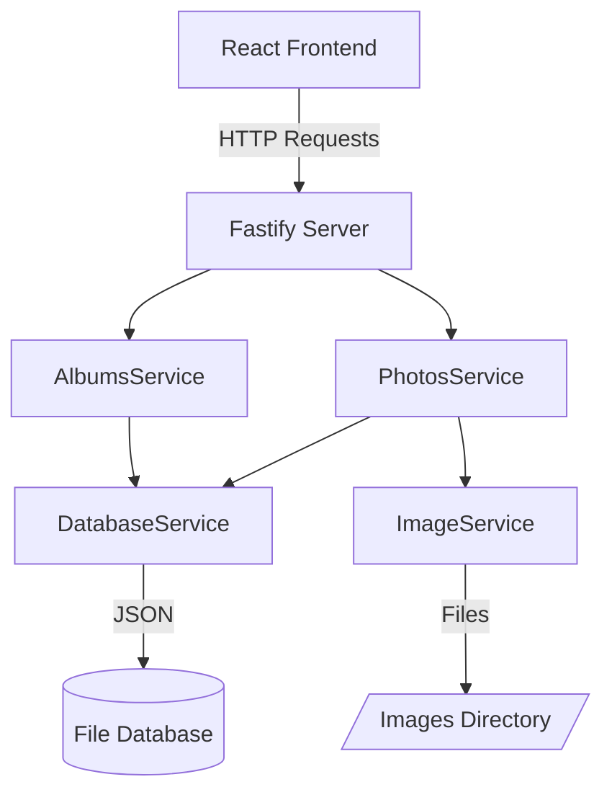

# 🖼️ Gallery Plus

<div align="center">

**A modern and elegant photo gallery application built with React, TypeScript, and Tailwind CSS**

*Gallery Plus allows users to upload, organize, and manage their photo collections with album functionality and advanced search capabilities.*

<br />


<br />

[🚀 Quick Start](#-quick-start) •
[📋 Features](#-features) •
[🛠️ Tech Stack](#️-tech-stack) •
[📖 API Docs](#-api-documentation) •
[🤝 Contributing](#-contributing)

</div>

---

## ✨ Features

<table>
<tr>
<td width="50%">

### 📸 **Photo Management**
- ✅ **Upload Photos** - PNG, JPG, JPEG up to 50MB
- ✅ **Photo Details** - View and manage properties
- ✅ **Smart Navigation** - Previous/next controls
- ✅ **Safe Deletion** - Confirmation with cleanup
- ✅ **File Validation** - Automatic type & size check

### 📁 **Album Organization**
- ✅ **Create Albums** - Custom photo collections
- ✅ **Smart Filtering** - Filter by album or view all
- ✅ **Multi-Assignment** - Photos in multiple albums
- ✅ **Real-time Updates** - Dynamic management
- ✅ **Cascade Deletion** - Clean album removal

</td>
<td width="50%">

### 🔍 **Search & Discovery**
- ✅ **Real-time Search** - Debounced title search
- ✅ **Advanced Filtering** - Combined album + search
- ✅ **Live Counter** - Real-time photo counts
- ✅ **Context Navigation** - Smart photo browsing

### 🎨 **User Experience**
- ✅ **Modern Design** - Dark theme with accents
- ✅ **Responsive Layout** - All screen sizes
- ✅ **Smooth Animations** - Skeleton loading states
- ✅ **Accessible UI** - Built with Radix primitives
- ✅ **Interactive Feedback** - Hover effects & transitions

</td>
</tr>
</table>

---

## 🚀 Quick Start

### Prerequisites
```bash
Node.js 18+ and PNPM package manager required
```

### 1️⃣ Installation
```bash
# Clone the repository
git clone <repository-url>
cd gallery-plus

# Install dependencies
pnpm install
```

### 2️⃣ Environment Setup
```bash
# Create .env file
echo "VITE_API_URL=http://localhost:5799" > .env
echo "VITE_IMAGES_URL=http://localhost:5799/images" >> .env
echo "PORT=5799" >> .env
```

### 3️⃣ Development
```bash
# Terminal 1: Start backend server
pnpm dev-server

# Terminal 2: Start frontend development
pnpm dev
```

### 4️⃣ Access Application
- 🖥️ **Frontend**: `http://localhost:5173`
- 🔌 **API**: `http://localhost:5799`
- 🖼️ **Images**: `http://localhost:5799/images/`
- ❤️ **Health**: `http://localhost:5799/health`

---

## 🛠️ Tech Stack

<div align="center">

### 🎨 **Frontend Excellence**
| Technology | Version | Purpose |
|------------|---------|---------|
| **React** | 19.1.0 | UI Library with concurrent features |
| **TypeScript** | 5.8.3 | Type-safe development |
| **Tailwind CSS** | 4.1.10 | Utility-first styling |
| **React Router** | 7.7.0 | Client-side routing |
| **Tanstack Query** | 5.83.0 | Data fetching & caching |
| **React Hook Form** | 7.59.0 | Performance form handling |
| **Radix UI** | Latest | Accessible components |
| **Zod** | 3.22.4 | Schema validation |

### ⚡ **Backend Power**
| Technology | Version | Purpose |
|------------|---------|---------|
| **Fastify** | 4.24.3 | High-performance web framework |
| **TypeScript** | 5.8.3 | Server-side type safety |
| **Zod** | 3.22.4 | Request/response validation |
| **Multipart** | 8.0.0 | File upload handling |
| **CORS** | 8.5.0 | Cross-origin support |

### 🔧 **Development Tools**
| Tool | Version | Purpose |
|------|---------|---------|
| **Vite** | 6.3.5 | Lightning-fast build tool |
| **ESLint** | 9.25.0 | Code linting |
| **PNPM** | Latest | Fast package management |
| **TSUP** | 8.5.0 | TypeScript compilation |

</div>

---

## 🏗️ Architecture & Project Structure

<div align="center">

### 🎯 **Service-Oriented Architecture**



</div>

<details>
<summary>📁 <strong>Detailed Project Structure</strong></summary>

```
gallery-plus/
├── 🎨 Frontend (src/)
│   ├── assets/                 # Icons, images, illustrations
│   │   ├── icons/             # SVG icon components
│   │   └── images/            # Brand assets
│   ├── components/            # Reusable UI components
│   │   ├── alert.tsx          # Notification system
│   │   ├── button.tsx         # Button variants
│   │   ├── dialog.tsx         # Modal components
│   │   ├── input-*.tsx        # Form controls
│   │   └── ...                # More UI components
│   ├── contexts/              # Feature domains
│   │   ├── albums/            # Album management
│   │   │   ├── components/    # Album UI components
│   │   │   ├── hooks/         # Album business logic
│   │   │   ├── models/        # TypeScript interfaces
│   │   │   └── schemas.ts     # Validation schemas
│   │   └── photos/            # Photo management
│   │       └── ...            # Similar structure
│   ├── helpers/               # Utilities
│   │   ├── api.ts            # HTTP client setup
│   │   └── utils.ts          # Common functions
│   └── pages/                 # Route components
│       ├── page-home.tsx      # Gallery view
│       └── page-photo-details.tsx # Detail view
│
├── ⚡ Backend (server/)
│   ├── albums/                # Album domain
│   │   ├── albums-interfaces.ts # Types & validation
│   │   ├── albums-routes.ts   # HTTP endpoints
│   │   └── albums-service.ts  # Business logic
│   ├── photos/                # Photo domain
│   │   └── ...                # Similar structure
│   ├── services/              # Shared services
│   │   ├── database-service.ts # JSON database
│   │   └── image-service.ts   # File management
│   ├── models.ts              # Shared interfaces
│   └── main.ts                # Server entry point
│
├── 💾 Runtime (data/) - Auto-created
│   ├── db.json                # JSON database
│   └── images/                # Uploaded files
│
└── 🔧 Configuration
    ├── package.json           # Dependencies
    ├── tsconfig.*.json        # TypeScript configs
    ├── tailwind.config.js     # Styling config
    └── vite.config.ts         # Build config
```

</details>

---

## 📖 API Documentation

<div align="center">

### 🔗 **RESTful Endpoints**

</div>

<table>
<tr>
<th width="50%">📸 <strong>Photos API</strong></th>
<th width="50%">📁 <strong>Albums API</strong></th>
</tr>
<tr>
<td>

```http
GET    /photos                 # List photos
GET    /photos/:id             # Photo details
POST   /photos                 # Create photo
POST   /photos/:id/image       # Upload image
PATCH  /photos/:id             # Update title
DELETE /photos/:id             # Delete photo
PUT    /photos/:id/albums      # Manage albums
```

</td>
<td>

```http
GET    /albums                 # List albums
GET    /albums/:id             # Album details
POST   /albums                 # Create album
DELETE /albums/:id             # Delete album
```

</td>
</tr>
</table>

### 🔍 **Query Parameters**
```http
GET /photos?albumId=uuid           # Filter by album
GET /photos?q=search-term          # Search by title
GET /photos?albumId=uuid&q=term    # Combined filtering
```

<details>
<summary>📋 <strong>Request/Response Examples</strong></summary>

**Create Photo:**
```json
POST /photos
{
  "title": "Beautiful Sunset",
  "albumsIds": ["uuid1", "uuid2"]  // optional
}
```

**Upload Image:**
```http
POST /photos/:id/image
Content-Type: multipart/form-data

file: [binary image data]
```

**Manage Photo Albums:**
```json
PUT /photos/:id/albums
{
  "albumsIds": ["uuid1", "uuid2", "uuid3"]
}
```

**Create Album:**
```json
POST /albums
{
  "title": "My Vacation Photos"
}
```

</details>

---

## 🎨 Design System

<div align="center">

### 🌈 **Color Palette**

</div>

<table>
<tr>
<td width="33%">

**🌙 Backgrounds**
```css
--bg-primary: #040d18
--bg-secondary: #262337  
--bg-tertiary: #3c3857
```

</td>
<td width="33%">

**🎯 Brand Colors**
```css
--brand: #1ccfc3
--brand-light: #66eae1
--danger: #f54a26
```

</td>
<td width="34%">

**📝 Text & Borders**
```css
--border: #2c2c35
--border-active: #4c4c5d
--text: #fafcff
```

</td>
</tr>
</table>

### 📝 **Typography Scale**

| Style | Size | Weight | Line Height | Usage |
|-------|------|--------|-------------|--------|
| **Heading Large** | 24px | Bold | 130% | Page titles |
| **Heading Medium** | 20px | Bold | 130% | Section titles |
| **Paragraph Large** | 16px | Medium | 150% | Body text |
| **Label Medium** | 16px | Semibold | 150% | Form labels |

### 🧩 **Component Variants**

<table>
<tr>
<td width="25%"><strong>🔘 Buttons</strong><br/>Primary, Secondary, Ghost, Destructive</td>
<td width="25%"><strong>📝 Inputs</strong><br/>Text, File Upload, Checkbox</td>
<td width="25%"><strong>🗃️ Cards</strong><br/>Default, Primary backgrounds</td>
<td width="25%"><strong>🏷️ Badges</strong><br/>Ghost variant, multiple sizes</td>
</tr>
</table>

---

## 🔒 Security & Performance

<div align="center">

### 🛡️ **Security Features**

</div>

<table>
<tr>
<td width="50%">

**🔍 Input Validation**
- ✅ Zod schemas (client + server)
- ✅ File type validation (PNG, JPG, JPEG)
- ✅ Size limits (50MB maximum)
- ✅ UUID format validation
- ✅ String length constraints

**🚨 Error Handling**
- ✅ Graceful error boundaries
- ✅ User-friendly toast notifications
- ✅ Detailed API error responses
- ✅ Automatic file cleanup

</td>
<td width="50%">

**⚡ Performance Optimizations**
- ✅ React Query caching
- ✅ Debounced search (200ms)
- ✅ Code splitting & lazy loading
- ✅ Skeleton loading states
- ✅ Optimized image serving

**🔄 Backend Efficiency**
- ✅ Fastify high-performance framework
- ✅ File streaming for uploads
- ✅ Atomic database operations
- ✅ Static file serving optimization

</td>
</tr>
</table>

---

## 🌐 Browser Support

<div align="center">

| Browser | Version | Status |
|---------|---------|--------|
| Chrome | 90+ | ✅ Full Support |
| Firefox | 88+ | ✅ Full Support |
| Safari | 14+ | ✅ Full Support |
| Edge | 90+ | ✅ Full Support |

</div>

---

## 🤝 Contributing

<div align="center">

**We welcome contributions! Here's how to get started:**

</div>

### 🚀 **Development Workflow**

1. **🍴 Fork** the repository
2. **🌿 Create** your feature branch
   ```bash
   git checkout -b feature/amazing-feature
   ```
3. **💻 Code** following our guidelines
4. **🧪 Test** your changes thoroughly
5. **📝 Commit** with semantic messages
   ```bash
   git commit -m 'feat: add amazing feature'
   ```
6. **🚀 Push** to your branch
   ```bash
   git push origin feature/amazing-feature
   ```
7. **🔀 Submit** a Pull Request

### 📋 **Development Guidelines**
- ✅ Follow TypeScript strict mode
- ✅ Use Zod for all API validation  
- ✅ Implement proper error handling
- ✅ Add loading states for async operations
- ✅ Write semantic commit messages
- ✅ Test on multiple browsers

---

## 🚀 Production Deployment

<details>
<summary><strong>📦 Build & Deploy Instructions</strong></summary>

### **Build for Production**
```bash
# Build entire project (server + client)
pnpm build

# Run production server
pnpm run-server
```

### **Environment Variables**
```bash
# Production environment
VITE_API_URL=https://your-api-domain.com
VITE_IMAGES_URL=https://your-api-domain.com/images
PORT=5799
```

### **Docker Deployment** (Optional)
```dockerfile
FROM node:18-alpine
WORKDIR /app
COPY package*.json ./
RUN npm install
COPY . .
RUN npm run build
EXPOSE 5799
CMD ["npm", "run", "run-server"]
```

</details>

---

## 📈 Roadmap & Future Enhancements

<div align="center">

### 🎯 **Planned Features**

</div>

<table>
<tr>
<td width="50%">

**🔐 Authentication & Users**
- [ ] Multi-user support
- [ ] User permissions system
- [ ] Social login integration

**☁️ Cloud & Storage**
- [ ] AWS S3 integration
- [ ] CDN for image delivery
- [ ] Automatic backups

</td>
<td width="50%">

**🎨 Enhanced Features**
- [ ] Image processing & optimization
- [ ] Bulk operations & multi-select
- [ ] Export & sharing capabilities
- [ ] Mobile companion app

**⚡ Performance & Scale**
- [ ] Real-time sync with WebSockets
- [ ] Database migration to PostgreSQL
- [ ] Advanced caching strategies

</td>
</tr>
</table>

---

## 📄 License

<div align="center">

This project is licensed under the **MIT License**

*See the [LICENSE](LICENSE) file for details*

</div>

---

## 🙏 Acknowledgments

<div align="center">

**Special thanks to the amazing open source community:**

| | | |
|:---:|:---:|:---:|
| 🚀 **[Rocketseat](https://rocketseat.com.br)** | 🧩 **[Radix UI](https://radix-ui.com)** | 🎨 **[Tailwind CSS](https://tailwindcss.com)** |
| *Project inspiration* | *Accessible components* | *Utility-first CSS* |
| ⚡ **[Fastify Team](https://fastify.io)** | ⚛️ **[React Team](https://react.dev)** | 🔥 **[Vite](https://vitejs.dev)** |
| *High-performance framework* | *Amazing ecosystem* | *Lightning-fast tooling* |

<br />

---

<div align="center">

### 🌟 **Made with ❤️ by developers, for developers**

**Gallery Plus** - *Where memories meet modern technology*

<br />

[](https://github.com/your-username/gallery-plus)
[](https://github.com/your-username/gallery-plus/issues)
[](https://github.com/your-username/gallery-plus/issues)

</div>

</div>
